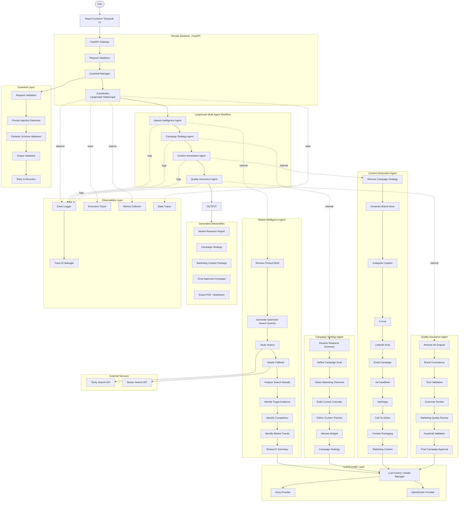

# AI Marketing Team - Multi-Agent Architecture

## Architecture Notes

### Current Scope (Version 1)

This architecture focuses on delivering an end-to-end AI Marketing Team capable of transforming a user's marketing brief into a complete campaign using a coordinated multi-agent workflow. The project prioritizes modularity, explainability, and production-inspired software engineering practices while remaining deployable using free-tier AI services.

### Content Generation

The Content Generation Agent **does not publish content directly** to social media platforms.

Instead, it generates a complete marketing package that is displayed within the application interface, including:

- Instagram caption
- X (Twitter) post
- LinkedIn post
- Email campaign copy
- Advertisement headlines
- Hashtags
- Call-to-action

This simulated approach allows users to review, edit, and export the generated campaign before publishing through their preferred marketing tools.

### Multi-Agent Coordination

The LangGraph Coordinator orchestrates the entire workflow using deterministic routing:

1. Market Intelligence Agent performs market research and audience analysis.
2. Campaign Strategy Agent transforms research into a marketing strategy.
3. Content Generation Agent creates platform-specific marketing assets.
4. Quality Assurance Agent validates consistency, quality, and completeness before returning the final campaign.

Each agent has a single responsibility, making the system modular and easy to extend.

### LLM Provider Abstraction

Rather than coupling agents directly to a specific model, all LLM interactions are routed through a centralized **LLM Factory / Model Manager**.

This abstraction provides:

- Provider independence (Groq or OpenRouter)
- Centralized model configuration
- Simplified provider switching
- Cleaner separation between business logic and LLM implementation

Specific model selection is intentionally configurable and not hardcoded within the architecture.

### Search Layer

Only the **Market Intelligence Agent** performs external web searches.

The remaining agents operate exclusively on structured outputs produced by previous agents, reducing API usage, improving consistency, and minimizing token consumption.

### Guardrails

Guardrails are applied before and after agent execution to improve reliability.

Current safeguards include:

- Request validation
- Prompt injection detection
- Structured output validation using Pydantic
- Output validation
- Retry and graceful recovery mechanisms

### Observability

The pipeline includes lightweight observability to improve transparency and debugging.

Execution metadata includes:

- Agent execution timeline
- Event logging
- State transitions
- Performance metrics
- Trace identifiers

These components make it easier to understand what each agent executed, how long each step required, and where failures occurred during pipeline execution.

### Deployment

The system is designed to be cloud deployable without requiring model hosting or training.

- **Frontend:** React (or Streamlit during development)
- **Backend:** FastAPI hosted on Render
- **Multi-Agent Framework:** LangGraph
- **LLM Providers:** Groq and OpenRouter
- **Search Providers:** Tavily and Serper

All intelligence is provided through external APIs, allowing the application to run entirely on commodity cloud infrastructure.